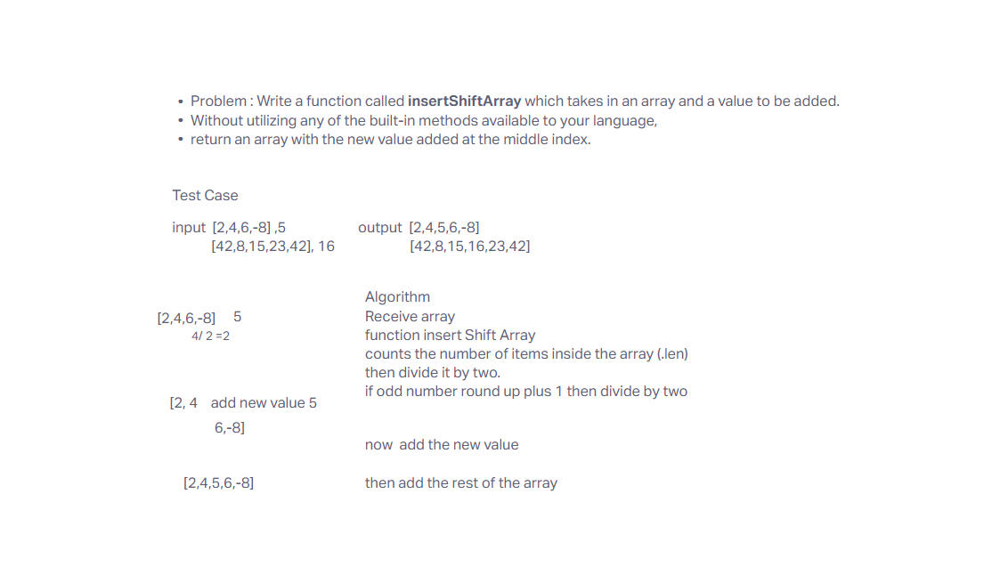

# Challenge Title
Write a function called insertShiftArray which takes in an array and a value to be added. Without utilizing any of the built-in methods available to your language, return an array with the new value added at the middle index.

## Whiteboard Process

## Approach & Efficiency
The approach to use a for loop and reverse the array by iterating from the last index to the first index

## Solution

