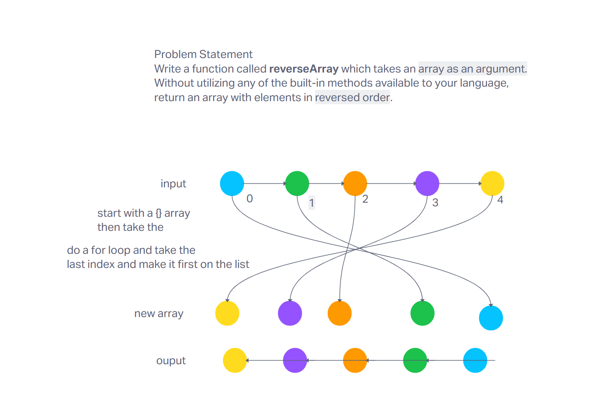

# Challenge Title
Write a function called reverseArray which takes an array as an argument. Without utilizing any of the built-in methods available to your language, return an array with elements in reversed order.

## Whiteboard Process


## Approach & Efficiency
The approach to use a for loop and reverse the array by iterating from the last index to the first index

## Solution
```python
def reverseArray(arr):
    # Initialize an empty list to store reversed elements
    reversed_arr = []

    # Iterate over the original array in reverse order ( got help with ChatGPT)
    for i in range(len(arr) - 1, -1, -1):
        reversed_arr.append(arr[i])

    return reversed_arr```


