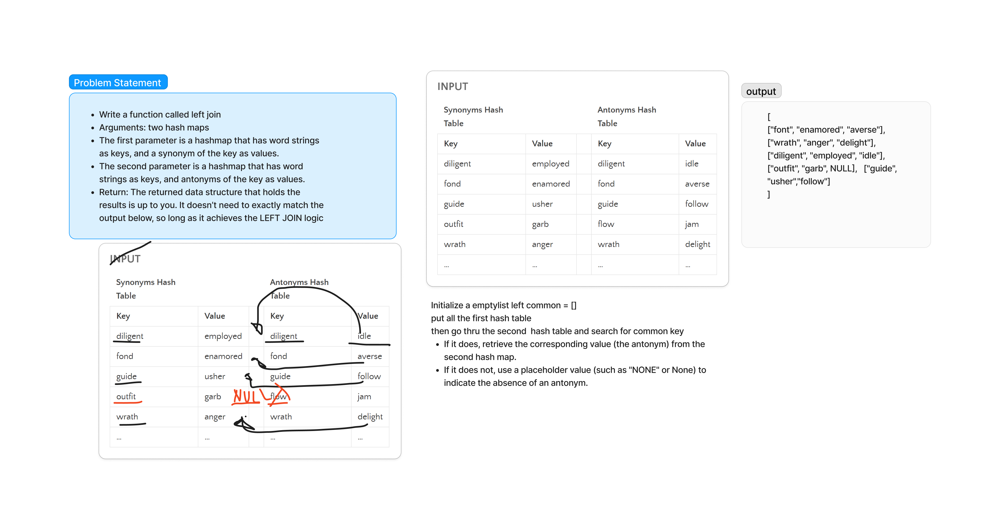

# Challenge Title
Find common values in 2 binary trees.

Write a function that LEFT JOINs two hashmaps into a single data structure.

Arguments: two hash maps

The first parameter is a hashmap that has word strings as keys, and a synonym of the key as values.

The second parameter is a hashmap that has word strings as keys, and antonyms of the key as values.

Return: The returned data structure that holds the results is up to you. It doesn’t need to exactly match the output below, so long as it achieves the LEFT JOIN logic

## Whiteboard Process

## Approach & Efficiency

the approach is iterate through the First Hash Map (Synonyms): For each key-value pair in the first hash map, perform the following steps:

Key Extraction: Extract the key and its corresponding value (the synonym).
Search for Matching Key in the Second Hash Map (Antonyms): Check if the current key exists in the second hash map.

* If it does, retrieve the corresponding value (the antonym) from the second hash map.

* If it does not, use a placeholder value (such as "NONE" or None) to indicate the absence of an antonym.

the combine and store in a new list

## Solution