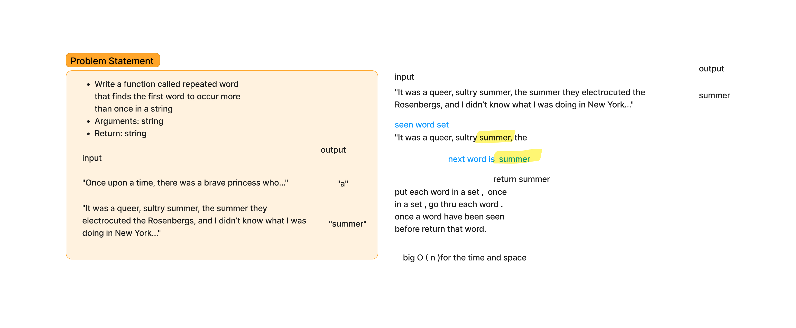

# Challenge Title

Write a function called repeated word that finds the first word to occur more than once in a string
Arguments: string
Return: string

## Whiteboard Process

## Approach & Efficiency
Create an empty set to keep track of words that you have already encountered as you go through the list. Sets are chosen because they allow for quick checks on whether an item is already present.
Iterate through each word in the list created from the input string. For each word:
For each processed word (with trailing punctuation removed), check if it has already been seen (i.e., if it is already in the set of seen words).
If the word has been seen before, return this word immediately as the first repeated word.
If the word has not been seen before, add it to the set of seen words and proceed to the next word in the list.

## Solution
