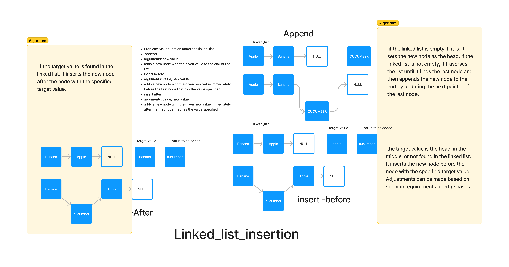

# Challenge Title

Linked List Insertions

## Whiteboard Process

## Approach & Efficiency

The approach focuses on creating a new node with the given value and appropriately adjusting pointers to insert the node at the desired location. The time complexity varies for each operation: O(1) for inserting at the beginning, O(n) for inserting at the end (as it may require traversing the entire list), and O(n) for inserting before/after a target value (as it involves traversing the list until the target is found).

## Solution

The solution provides a Python implementation of a linked list with the specified insertion operations. The LinkedList class contains methods (insert, append, insert_before, and insert_after) to handle each insertion scenario. The code includes error handling for cases where a target value is not found, raising a TargetError to indicate such situations. The whiteboard diagram visually illustrates the step-by-step process of each insertion operation.
