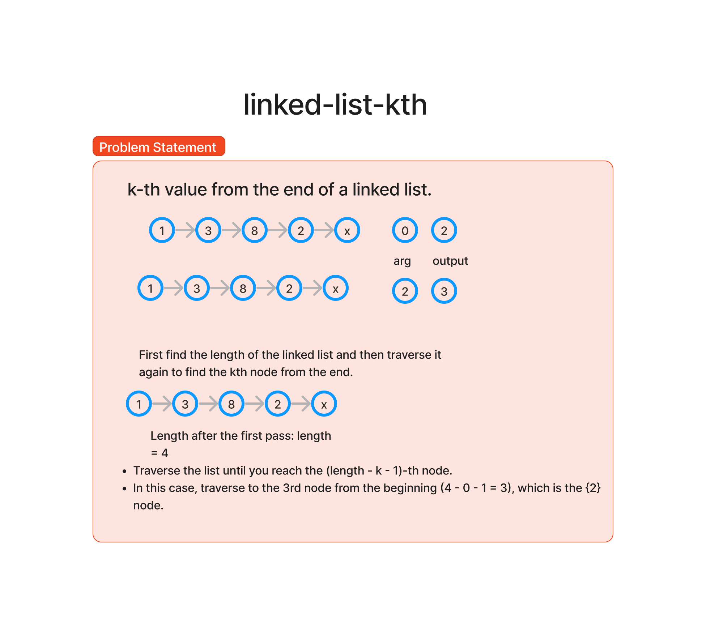

# Challenge Title
kth_from_end

## Whiteboard Process

## Approach & Efficiency
function involves using two pointers – a slow pointer and a fast pointer. The fast pointer is moved k nodes ahead of the slow pointer, and then both pointers are advanced together until the fast pointer reaches the end of the list. At this point, the slow pointer is pointing to the node that is k places from the tail.

## Solution
