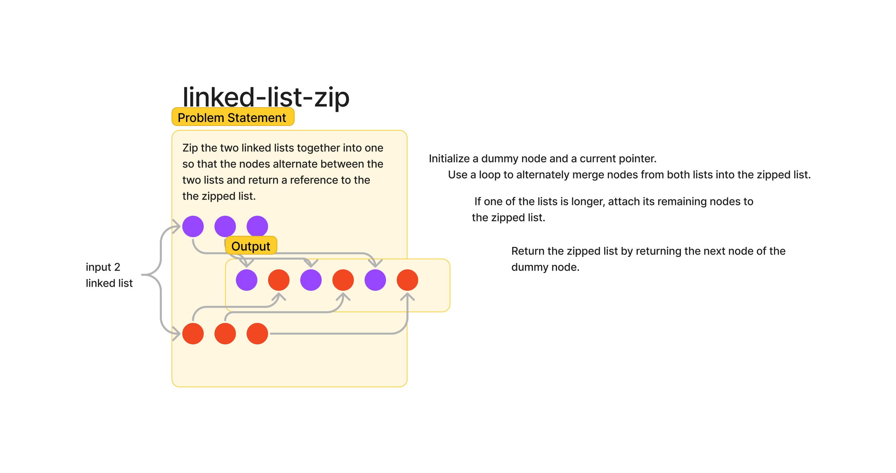

# Challenge Title
Linked List Zip

## Whiteboard Process

## Approach & Efficiency
zipping two linked lists can be achieved by alternating the nodes directly, without using additional imports or iterators. This method involves directly traversing each list and connecting the nodes alternately from each list. 

## Solution

The function iterates over both input linked lists simultaneously.It alternates nodes from each list, effectively linking nodes from list_b into list_a.
If one of the lists is longer, the additional elements are appended at the end of the merged list.The function handles edge cases such as one or both lists being empty.