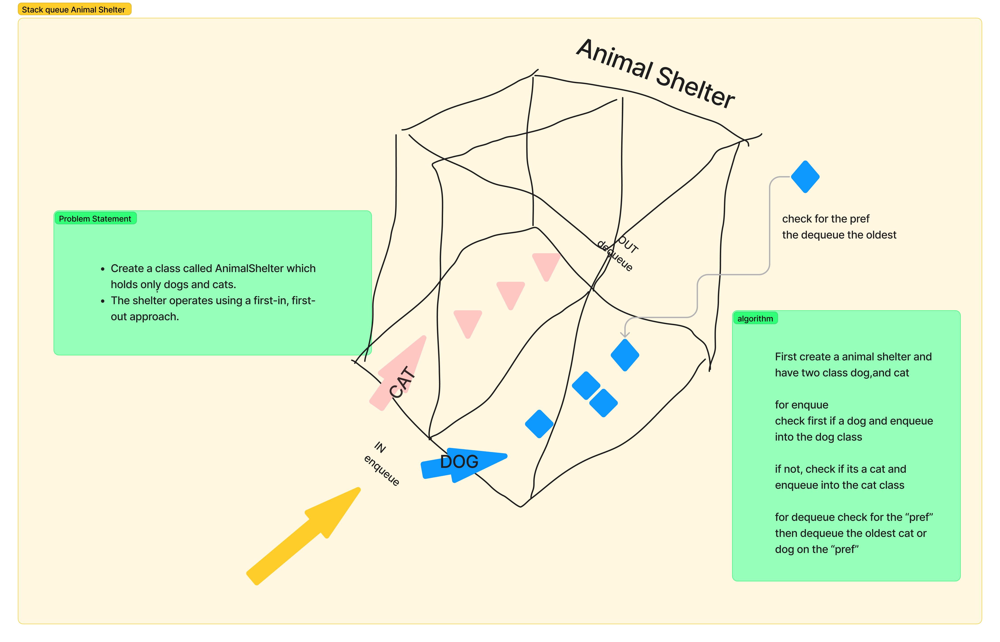

# Challenge Title
Create a class called AnimalShelter which holds only dogs and cats.
The shelter operates using a first-in, first-out approach.

## Whiteboard Process

## Approach & Efficiency
 the shelter sets up two separate queues, one for each species, to maintain their arrival order. When a new animal arrives, whether it's a dog or a cat, it is added to the respective queue through the enqueue method, ensuring that the type of animal is correctly identified and placed in the appropriate queue. Adopting an animal from the shelter is handled by the dequeue method, where potential adopters can specify their preference for either a dog or a cat.

## Solution
