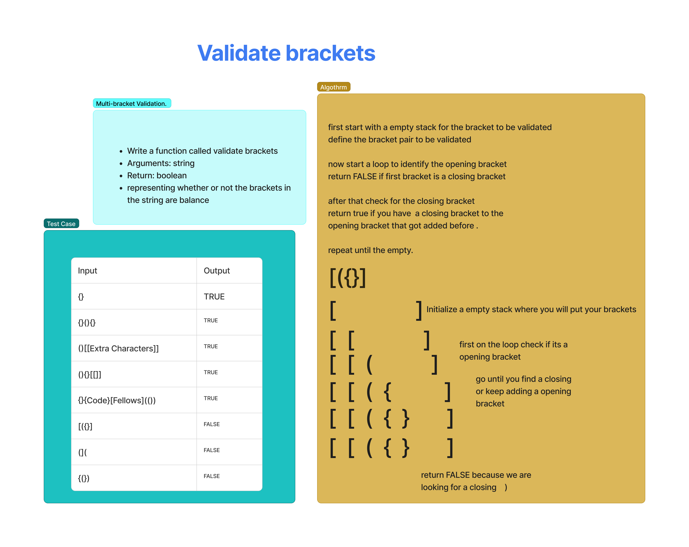

# Challenge Title
Write a function called validate brackets
Arguments: string
Return: boolean
representing whether or not the brackets in the string are balanced
There are 3 types of brackets:

Round Brackets : ()
Square Brackets : []
Curly Brackets : {}

## Whiteboard Process

## Approach & Efficiency
validate_brackets function, we can use a simple and efficient approach. We start by initializing an empty stack to keep track of opening brackets as we iterate through the input string. For each character in the string, we check if it's an opening bracket ('(', '[', or '{'). If it is, we push it onto the stack. If the character is a closing bracket (')', ']', or '}'), we check whether the stack is empty. If it's empty, we return False immediately because there's no corresponding opening bracket. If the stack is not empty, we pop the top element from the stack and compare it with the corresponding opening bracket for the current closing bracket using a predefined dictionary. If they don't match, we return False. After processing all characters in the string, we check if the stack is empty. If it's empty, we return True because all brackets have been balanced. If the stack is not empty, we return False because there are unmatched opening brackets. This approach efficiently and accurately checks whether the brackets in the input string are balanced or not.

## Solution