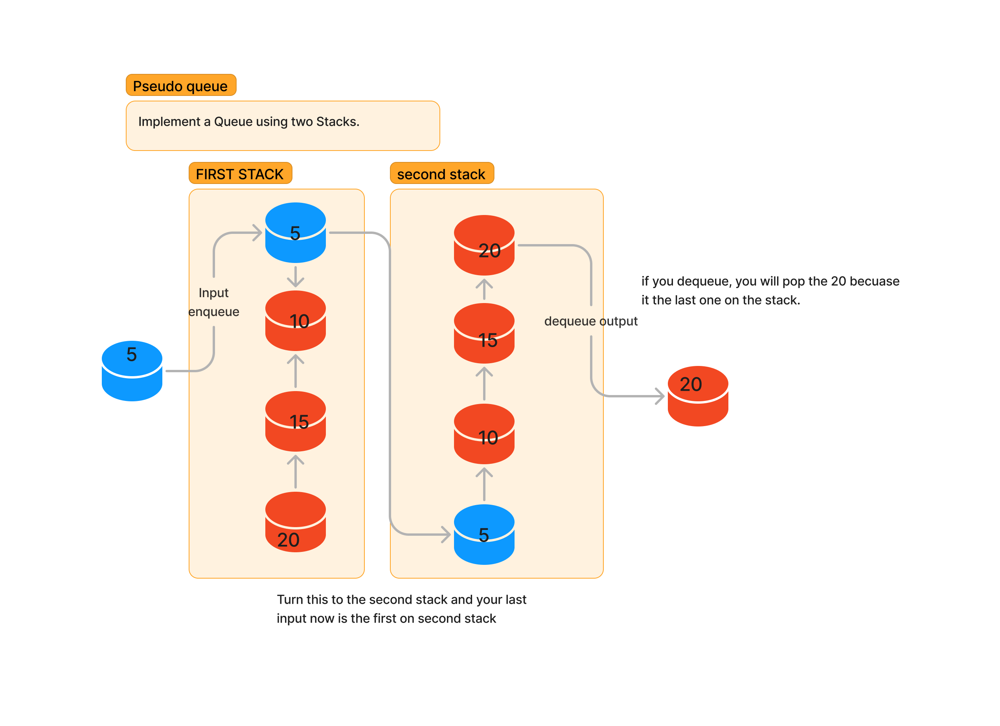

# Challenge Title
Pseudo Queue

## Whiteboard Process

## Approach & Efficiency
The PseudoQueue approach employs two stacks for queue operations. Enqueuing a value is a straightforward O(1) operation by pushing it onto stack1. For dequeuing, elements are transferred from stack1 to stack2 to reverse the order, which can be O(N) in the worst case. However, on average, dequeuing remains an efficient O(1) operation due to amortization. The space complexity is O(N), depending on the number of elements in the queue, considering both stack1 and stack2. This implementation effectively emulates a queue's behavior with efficient enqueue and dequeue operations.

## Solution
