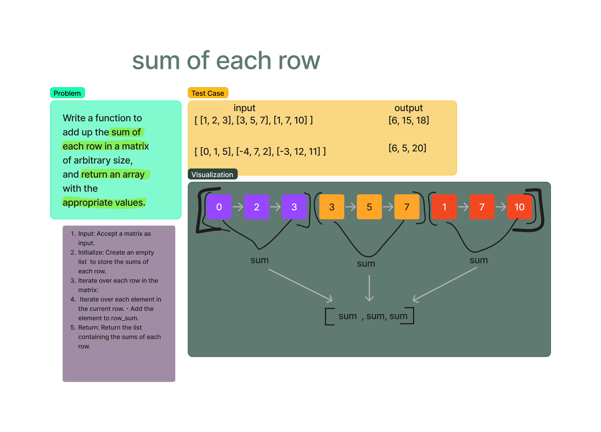

# Sum of each row
Write a function to add up the sum of each row in a matrix of arbitrary size, and return an array with the appropriate values..

## Whiteboard Process

## Approach & Efficiency

In this solution, the algorithm iterates over each row in the given matrix. For every row encountered, a variable called row_sum is initialized to zero. Subsequently, the algorithm iterates over each element within the current row, adding its value to the row_sum. Once all elements in a row are summed, the row_sum value is appended to the result array. This process is repeated for each row in the matrix, ultimately creating an array containing the sums of each row. The time complexity of the algorithm is O(m * n), where 'm' is the number of rows and 'n' is the number of columns, as it involves nested iterations over the rows and elements. The space complexity is O(m), where 'm' represents the number of rows, as the result array grows linearly with the number of rows in the matrix. This approach efficiently calculates the sum of each row without relying on built-in functions and is suitable for matrices of arbitrary size.

## Solution
