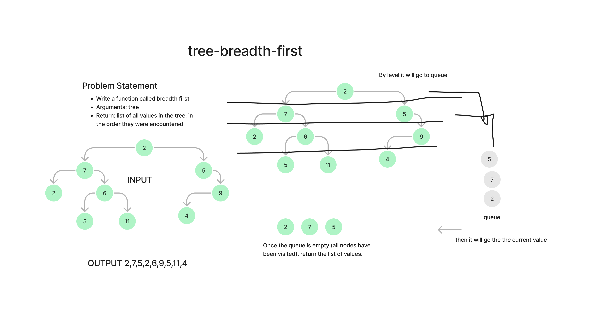

# Challenge Title
Write a function called breadth first
Arguments: tree
Return: list of all values in the tree, in the order they were encountered

## Whiteboard Process

## Approach & Efficiency
The approach involves creating a queue to manage the nodes that are yet to be visited and a list to store the values of nodes that have been visited. The process begins at the root of the tree. This root node is first enqueued into the queue. The algorithm then enters a loop, where nodes are dequeued from the queue and their values are recorded in the values list. After dequeuing a node, if it has any children (left and/or right), these child nodes are enqueued into the queue. This process is repeated until the queue is empty, ensuring that all nodes in the tree are visited in a level-order sequence. The loop ensures that each level of the tree is fully processed before moving on to the next level, characteristic of breadth-first traversal

## Solution