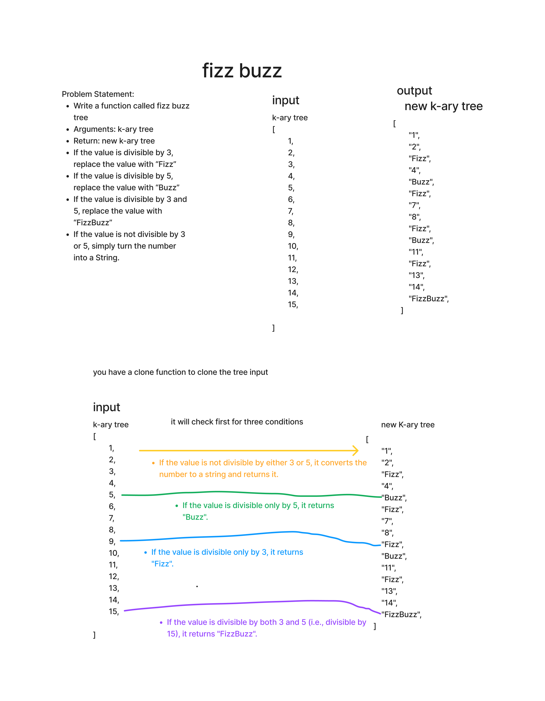

# Challenge Title
Conduct “FizzBuzz” on a k-ary tree while traversing through it to create a new tree.

Set the values of each of the new nodes depending on the corresponding node value in the source tree

## Whiteboard Process

## Approach & Efficiency

First we check for  values divisible by both 3 and 5 are transformed to "FizzBuzz", those divisible only by 3 to "Fizz", only by 5 to "Buzz", and all other values are converted to their string representation.

then put the values on a new clone k_ary tree for the output 

## Solution
