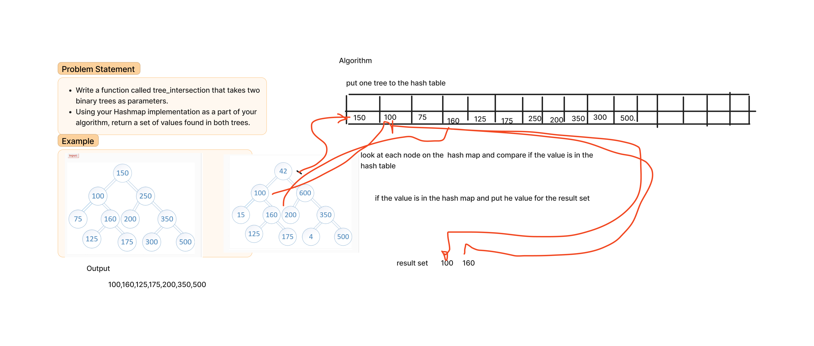

# Challenge Title
Find common values in 2 binary trees.

Write a function called tree_intersection that takes two binary trees as parameters.

Using your Hashmap implementation as a part of your algorithm, return a set of values found in both trees.

## Whiteboard Process

## Approach & Efficiency

the approach is create a hashtable to store values from the first tree and an empty set to accumulate the intersection results. It then traverses the first tree in a depth-first manner, inserting each node's value into the hashtable. 

Then traverse the second tree, also in a depth-first manner. During this traversal, for each node visited, it checks whether its value is already present in the hashtable, indicating that the same value exists in the first tree. If such a value is found, it is added to the result set, which is dedicated to storing all values found in both trees.

## Solution