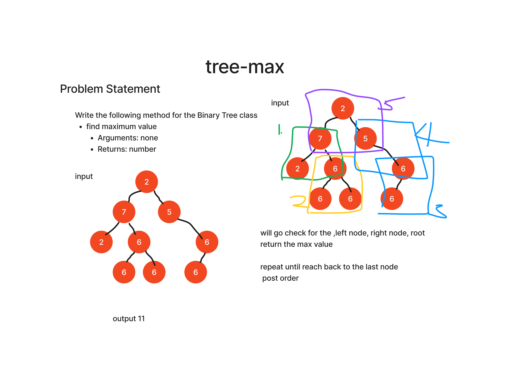

# Challenge Title
Write the following method for the Binary Tree class

find maximum value
Arguments: none
Returns: number
Find the maximum value stored in the tree. You can assume that the values stored in the Binary Tree will be numeric.

## Whiteboard Process

## Approach & Efficiency
Approach is using the recursive to find the maximum value in a binary tree
Recursively calls the find_max function on the left subtree (node.left) and right subtree (node.right).

Finally, it returns the maximum value among the current node.value, the result from the left subtree (left_max), and the result from the right subtree (right_max).

So, the order of checking values in this code is post-order: left subtree, right subtree, a

## Solution